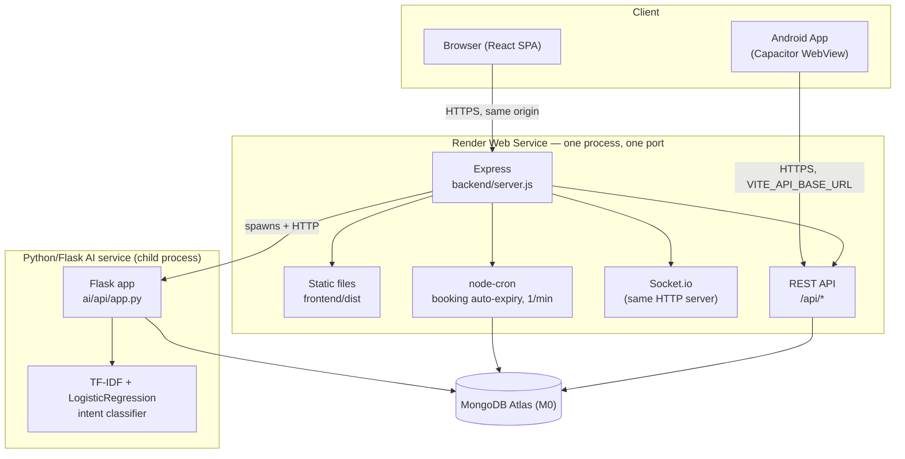
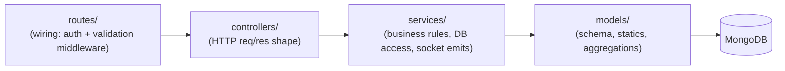
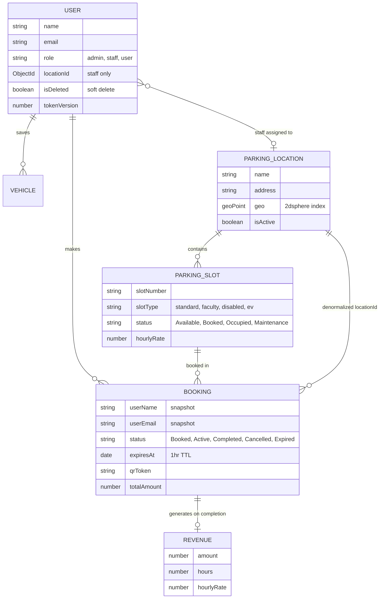
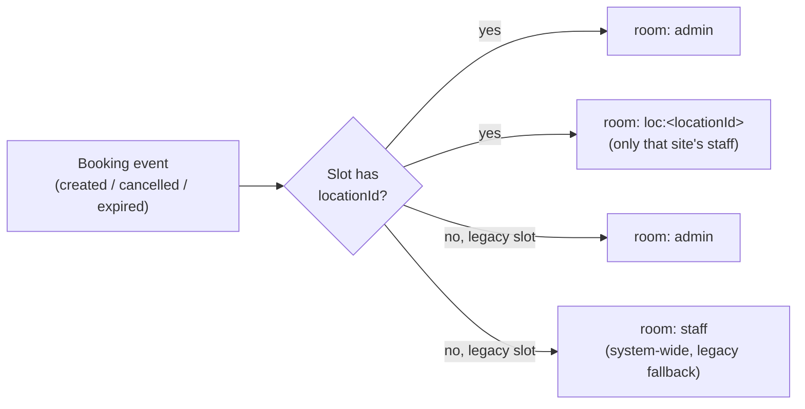
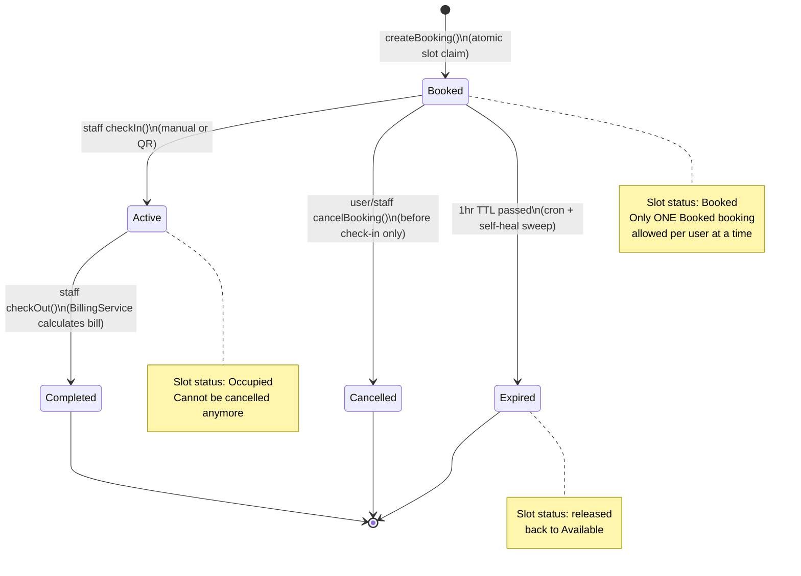
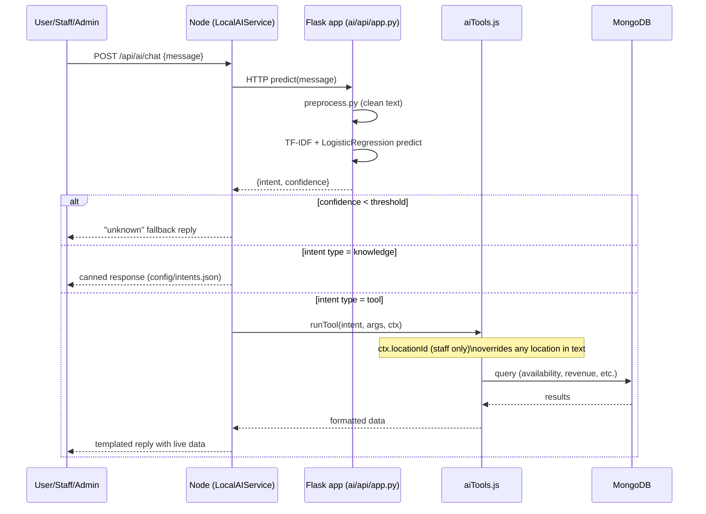

# ARCHITECTURE — Smart Car Parking Management System

## 1. High-level shape

One Git repo, three runtimes, **one deployed service**:



- **Frontend**: React 19 SPA (Vite build) → `frontend/dist`, served directly by Express in production. In dev, Vite's own dev server proxies `/api` to the backend.
- **Backend**: Node.js + Express REST API, MongoDB via Mongoose, JWT auth, Socket.io for live updates.
- **AI service**: separate Python/Flask process, spoken to by the Node backend over HTTP (`AI_API_URL`, default `http://127.0.0.1:5001`), started/stopped by `backend/utils/aiProcess.js`. Entirely optional (`SKIP_AI_PROCESS=true`).
- **Mobile**: the same React app, bundled via Capacitor into an Android project (`frontend/android`) — no separate mobile codebase.

Everything runs as **one Render Web Service** on **one URL** — deliberate, to fit free-tier hosting with a single process and a single port.

## 2. Backend structure

```
backend/
├── server.js              # app bootstrap: security middleware, static serving, routes, DB connect, cron, AI process
├── socket.js               # Socket.io init + room helpers (per-location staff rooms)
├── routes/                 # thin route definitions → controllers, wired with auth/validation middleware
├── controllers/             # HTTP-layer glue: parse req, call services, shape res
├── services/                 # business logic, OOP style (classes / class instances)
│   ├── BookingService.js     # booking lifecycle: create, cancel, expire, QR
│   ├── StaffService.js       # check-in/check-out, QR verification
│   ├── BillingService.js     # pure billing calculation (constructed per hourly rate)
│   ├── AdminService.js       # slot/location/staff/user management
│   ├── LocalAIService.js     # talks to the Python AI process, applies role/location scoping
│   └── aiTools.js            # "tool" implementations the AI can call (DB-backed lookups)
├── models/                  # Mongoose schemas (see Data Model below)
├── middleware/
│   ├── auth.middleware.js    # protect() (JWT verify + session-invalidation check), authorize(...roles)
│   ├── validation.middleware.js
│   └── error.middleware.js   # centralized error handler
└── utils/
    ├── aiProcess.js          # spawn/kill the Python AI child process
    ├── emailService.js       # Brevo transactional email (OTP)
    ├── qrCode.js              # QR token generation/verification, QR image generation
    ├── receiptGenerator.js    # PDF receipt generation (pdfkit)
    ├── vehicleValidation.js   # Indian vehicle-number format validation/normalization
    └── seeder.js              # creates the first admin account (npm run seed)
```

**Layering convention:** `routes` (wiring) → `controllers` (HTTP request/response shape, auth already applied by middleware) → `services` (business rules, DB access, Socket.io emits) → `models` (schema + static/instance helpers, including aggregation pipelines). Controllers should not contain business rules; services should not know about `req`/`res`.



## 3. Data model

### User
- `name, email, password (hashed, select:false), role (admin|staff|user)`
- `locationId` — set only for `staff`; pins them to exactly one `ParkingLocation`.
- `vehicles: [VehicleSchema]` — saved vehicles subdocuments.
- `isActive`, `isEmailVerified`, `profilePhoto`.
- `isDeleted` / `deletedAt` — soft-delete flag; on delete the record is anonymized, not removed, so foreign references (`Booking.userId`) stay valid.
- `tokenVersion` — bumped whenever an admin changes role/location; baked into JWTs at issue time so `protect()` can force-invalidate older sessions. Stripped from all JSON output via a `toJSON`/`toObject` transform.
- OTP fields (`otpCode`, `otpExpiresAt`, `otpPurpose`, `otpNewEmail`) support both registration and email-change OTP flows.

### ParkingLocation
- `name, address, description, amenities[]`
- `geo: { type: 'Point', coordinates: [lng, lat] }` with a `2dsphere` index — powers "Nearby Parking" geo queries.
- `isActive`. Virtuals `latitude`/`longitude` for convenience.

### ParkingSlot
- `slotNumber (unique), location (free-text fallback), locationId (optional ref)`
- `floor, slotType (standard|faculty|disabled|ev), hourlyRate, status (Available|Booked|Occupied|Maintenance), isActive`
- Statics: `getAvailableSlots()`, `getSlotStats(locationId?)`.

### Booking
- `userId, userName, userEmail` (name/email are a **point-in-time snapshot** taken at booking creation — survives user deletion/anonymization).
- `slotId, locationId` (locationId denormalized from the slot for cheap location-scoped queries).
- `bookingTime, expiresAt` (1-hour check-in window), `checkInTime, checkOutTime, totalHours, totalAmount`.
- `vehicleId` (ref to a subdocument in `User.vehicles`, if a saved vehicle was used), `vehicleCategory, vehicleNumber, registrationPending`.
- `status: Booked | Cancelled | Completed | Active | Expired`; `cancelledAt, cancelledBy, notes`.
- `qrToken (select:false), qrUsed, qrUsedAt` — single-use QR check-in support, additive to the manual flow.
- Statics carry most reporting logic as aggregation pipelines: `getRevenue`, `getDailyRevenue`, `getRevenueByLocation`, `getLocationRevenue`, `getDailyRevenueForLocation`, `getOccupancyInsights` (peak/quiet hours, busiest days, avg session length, top slots — optionally scoped to one location).
- Indexes: `{userId,status}`, `{slotId,status}`, `{status,expiresAt}`, `{locationId,status}`.

### Revenue
- A per-booking financial record (`bookingId (unique), userId, slotId, amount, hours, hourlyRate, generatedAt`) — a durable ledger entry distinct from the on-the-fly aggregations computed off `Booking`.

### Entity relationships



## 4. API surface

Mounted under `/api`:

| Prefix | Access | Purpose |
|---|---|---|
| `/auth` | public + protected | register (OTP), login, password reset, profile, email change, account deletion, saved vehicles |
| `/slots` | `/stats` public; rest `protect` | available/all slots, single slot, stats |
| `/bookings` | `protect` | create/list/get own bookings, receipt PDF, QR image, cancel |
| `/staff` | `protect + authorize(staff,admin)` | active/all bookings, stats, check-in/out, cancel, QR verify/check-in |
| `/admin` | `protect + authorize(admin)` | dashboard, revenue, users, slots, locations (+ per-location staff CRUD) |
| `/ai` | `protect` + own rate limiter | chat, scan-plate |
| `/locations` | `protect` | nearby search, list, get by id |
| `/support` | public + own rate limiter | contact form → EmailJS relay |

All API responses follow a `{ success, message?, data? }`-style shape (see individual controllers); errors flow through `error.middleware.js`.

## 5. Auth & authorization

- **JWT** issued on login/registration, containing `id, role, name, locationId, tokenVersion`.
- `protect` middleware: verifies signature/expiry, loads the user, rejects if the account is deleted/deactivated, and — critically — rejects if the token's `tokenVersion` no longer matches the current DB value (forces logout on role/location change by an admin).
- `authorize(...roles)` middleware: simple allow-list check against `req.user.role`.
- **Location scoping for staff** is enforced in the **service layer**, not just via role: `StaffService`/`BookingService` methods take an optional `staffLocationId` and reject operations on bookings belonging to a different location. This is the mechanism that actually confines a staff account to "their" site — the route/middleware layer alone doesn't know about locations.

## 6. Real-time layer (Socket.io)

- Initialized on the same raw `http.Server` as Express (`socket.js`), so Render only needs one exposed port.
- Rooms: `admin`, `staff` (legacy/system-wide), and `loc:<locationId>` per parking location.
- `staffBroadcastTargets(locationId)` helper decides who hears a booking event: admins always; staff only if the slot has a `locationId` (otherwise falls back to the old blanket `staff` room, for un-migrated legacy data).
- Events emitted: `slotUpdated`, `bookingCreated`, `bookingCancelled`, `bookingUpdated`, `bookingExpired`.



## 7. Concurrency & data-integrity mechanisms worth knowing

- **No double-booking:** `ParkingSlot.findOneAndUpdate({_id, status:'Available'}, {status:'Booked'})` is one atomic Mongo operation — under concurrent requests for the same slot, only one can flip it; everyone else's filter simply stops matching. A read-then-write pattern was deliberately avoided here.
- **Booking creation is transactional-ish via manual rollback:** if `Booking.create(...)` throws after the slot was already flipped to `Booked`, the slot is explicitly reset back to `Available` in a `catch`.
- **Self-healing stale-booking expiry:** the 1-hour auto-expiry sweep (`expireStaleBookings`) is triggered both by a `node-cron` job (every minute) *and* inline at the top of `createBooking`/`getUserBookings`. This exists specifically because Render's free tier can put the whole Node process to sleep, silently pausing the cron job; the inline sweep guarantees the very request that wakes the process up also produces correct, non-stale data immediately.

### Booking lifecycle (state machine)



## 8. AI assistant architecture



- Two intent types: `knowledge` (return a canned response) and `tool` (Node calls into `aiTools.js`, which queries MongoDB directly — slot availability, locations, occupancy insights, a user's bookings/vehicles, and admin-only revenue/user-registry tools).
- `ctx.locationId` (present only for staff) always overrides any location mentioned in the chat text, so a staff member's assistant is hard-locked to their own site regardless of what they type.
- Model artifacts (`ai/model/*.pkl`) are trained offline via `ai/training/train.py` against `ai/dataset/parking_intents.csv` (see `ai/README.md`); the Render build command runs `build_dataset.py` and `train.py` as part of the deploy build step.
- The whole service is optional at runtime (`SKIP_AI_PROCESS=true`) with the rest of the app unaffected.

## 9. Frontend structure

```
frontend/src/
├── App.jsx                 # BrowserRouter + all route definitions, role-gated via RequireAuth
├── context/                # AuthContext (session/user state), NavContext
├── components/              # shared UI: Layout/Sidebar/AppShell, modals (Booking, QR, Photo crop, Legal, Confirm),
│                             #   AIChatWidget, LeafletMap, ThreeBackground (desktop-only 3D bg), toast host, etc.
├── lib/                     # api.js (fetch wrapper), socket.js, geo.js, pageCache.js, useInfiniteList/useCachedState/
│                             #   useRevalidate hooks, vehicleValidation.js (mirrors backend rules client-side), etc.
├── pages/
│   ├── Landing.jsx, Login.jsx, Register.jsx, Profile.jsx
│   ├── user/       (Dashboard, Bookings, NearbyParking)
│   ├── staff/       (Dashboard, CheckIn, CheckOut, Bookings, QRCheckIn)
│   └── admin/       (Dashboard, Slots, Locations, Users, Revenue, LocationRevenue, Bookings)
└── styles/                  # style.css (design system) + extra.css
```

- Routing is role-gated with `<RequireAuth roles={[...]}>`; legacy routes (`/user/slots`, `/user/book`) redirect to `/user/nearby` since booking is now exclusively done by first picking a location.
- API base path is relative (`/api`) for the normal web build (same-origin as the backend); for the Android/Capacitor build it must be set to an absolute URL via `VITE_API_BASE_URL`, since the app loads from `capacitor://localhost`.
- Maps use Leaflet + Esri World Street Map tiles + free Nominatim (geocoding) and OSRM (routing) — reflected directly in the backend's CSP (`imgSrc`/`connectSrc` allow-list in `server.js`).

## 10. Deployment

- **Single Render Web Service.** Build command builds the frontend, installs backend deps, and trains the AI model, in one shot; start command is `node backend/server.js`.
- Static assets (`frontend/dist/assets`) are served with a 1-year immutable cache (Vite content-hashes filenames); `index.html` is always served with `no-cache` so a redeploy is picked up immediately instead of pointing at stale hashed asset filenames.
- `app.get('*', ...)` is the SPA fallback for any non-`/api` path, always serving fresh `index.html`.
- External dependencies: MongoDB Atlas (M0), Brevo (transactional email for OTP), optionally EmailJS (contact form).
- See root `README.md` for the exact env var table and step-by-step Render setup.