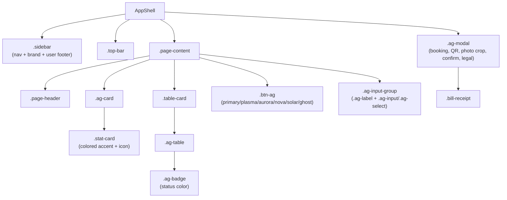
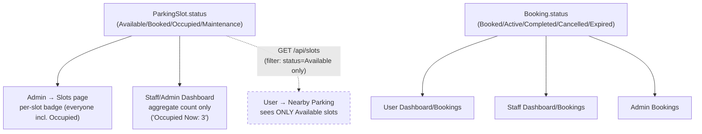

# DESIGN — "Anti-Gravity" Design System

> Reverse-engineered from `frontend/src/styles/style.css` (v2, "ANTI-GRAVITY SYSTEM") and `extra.css`. Theme name in the code: **Quantum Void / Zero-G / Holographic**.

## 1. Concept

A dark, futuristic "space/void" aesthetic: near-black backgrounds, neon cyan/blue accent glows, glassy translucent panels, and subtle motion (rise-in animations, a custom crosshair cursor, an optional Three.js particle background on desktop). It reads as a sci-fi control-room UI — appropriate for a "smart parking" product that leans into sensors/automation branding.

## 2. Color tokens (`:root` CSS variables)

### Backgrounds (darkest → lightest)
| Token | Value | Use |
|---|---|---|
| `--void` | `#010206` | Page background (near-black) |
| `--deep` | `#040a14` | Secondary background, scrollbar track |
| `--surface` | `#070f1e` | Modal / panel background |
| `--card` | `#0b1929` | Card background |
| `--card-hi` | `#0e2035` | Elevated card / hover state |
| `--lift` | `#122440` | Highest-elevation surface |

### Accent / semantic colors
| Token | Value | Typical meaning |
|---|---|---|
| `--plasma` | `#00f0ff` (cyan) | Primary brand accent, links, focus rings, "Available"/active glow |
| `--pulse` | `#0075ff` (blue) | Primary action buttons, "Completed"/user-role badges |
| `--nova` | `#ff3c78` (pink/red) | Danger, admin-role branding, "Occupied"/error states |
| `--aurora` | `#00ffb3` (green) | Success, "Available" status, verified state |
| `--solar` | `#ffb800` (amber) | Warning, "Booked"/staff-role, maintenance-adjacent |
| `--nebula` | `#8b5cf6` (purple) | Secondary accent (maintenance status, misc stat cards) |

**Palette, as actual colors:**

```mermaid
flowchart LR
    void["--void\n#010206"]:::void
    deep["--deep\n#040a14"]:::deep
    surface["--surface\n#070f1e"]:::surface
    card["--card\n#0b1929"]:::card
    plasma["--plasma\n#00f0ff"]:::plasma
    pulse["--pulse\n#0075ff"]:::pulse
    nova["--nova\n#ff3c78"]:::nova
    aurora["--aurora\n#00ffb3"]:::aurora
    solar["--solar\n#ffb800"]:::solar
    nebula["--nebula\n#8b5cf6"]:::nebula

    void ~~~ deep ~~~ surface ~~~ card ~~~ plasma ~~~ pulse ~~~ nova ~~~ aurora ~~~ solar ~~~ nebula

    classDef void fill:#010206,stroke:#333,color:#fff
    classDef deep fill:#040a14,stroke:#333,color:#fff
    classDef surface fill:#070f1e,stroke:#333,color:#fff
    classDef card fill:#0b1929,stroke:#333,color:#fff
    classDef plasma fill:#00f0ff,stroke:#333,color:#000
    classDef pulse fill:#0075ff,stroke:#333,color:#fff
    classDef nova fill:#ff3c78,stroke:#333,color:#fff
    classDef aurora fill:#00ffb3,stroke:#333,color:#000
    classDef solar fill:#ffb800,stroke:#333,color:#000
    classDef nebula fill:#8b5cf6,stroke:#333,color:#fff
```

### Text
| Token | Value | Use |
|---|---|---|
| `--t1` | `#dceeff` | Primary text (near-white, cool tint) |
| `--t2` | `#6a90b8` | Secondary text / muted labels |
| `--t3` | `#2a4a6a` | Tertiary / inactive nav text |
| `--t4` | `#0e2238` | Borders / dividers / disabled |

### Glows & shadows
- `--glow-plasma`, `--glow-aurora`, `--glow-nova`: soft 30px colored box-shadows used behind icons/status accents to reinforce the neon look.
- `--shadow-card`: `0 4px 32px rgba(0,0,0,.6), inset 0 1px 0 rgba(255,255,255,.04)` — standard card elevation with a faint top inner highlight (glass effect).
- `--shadow-float`: stronger elevation for floating/prominent elements, cyan-tinted.

### Layout tokens
- `--r-card: 18px` — standard card corner radius.
- `--r-btn: 10px` — standard button corner radius.
- `--sidebar-w: 265px` — fixed sidebar width, referenced by `.main-content { margin-left: var(--sidebar-w) }`.

**Rule of thumb when adding new UI:** never hardcode a hex color in a component — reference one of these tokens so the theme stays coherent and re-themeable from one place.

## 3. Typography

| Font | Role | Weights used |
|---|---|---|
| **Exo 2** | Display / headings (`h1`–`h6`), sidebar brand, top-bar title, page headers, stat values | 200, 400, 600, 700, 900 |
| **Syne** | Accent / label text — uppercase, letter-spaced micro-labels (`.brand-sub`, `.nav-section`, `.stat-label`, badge text, form labels) | 400, 600, 700, 800 |
| **DM Sans** | Body text (default on `body`) | 300, 400, 500 (+ italic 300) |

Loaded from Google Fonts via `@import` at the top of `style.css`.

- `.display-title` — the signature "hero" text treatment: 900-weight Exo 2 with a white→plasma→pulse gradient clipped to the text (`background-clip: text`).
- Labels, nav-section headers, and badges consistently use Syne, uppercase, with generous `letter-spacing` (0.07em–0.18em) — this is the recurring "sci-fi console" typographic signature. Reuse this pattern for any new label/eyebrow text rather than inventing a new style.

## 4. Core components (class reference)

### Sidebar navigation (`.sidebar`, `.sidebar-nav`, `.brand-icon`)
- Fixed, full-height, translucent dark panel with a `backdrop-filter: blur(24px)` glass effect and a subtle gradient border on the right edge.
- `.brand-icon` is a gradient badge (plasma→pulse for user/staff, nova-tinted `.admin-icon` variant for admin) — role is visually distinguished right at the top of the sidebar.
- Nav links get a hidden left accent bar (`::before`) that animates in on hover/active — a small but consistent "energizing" motion motif used elsewhere too.

### Top bar & page header (`.top-bar`, `.page-header`)
- Sits above `.page-content`, holds the page title.
- `.page-header` is a flex row with a title block on the left (`min-width:0; flex:1 1 0` — allows truncation) and actions on the right (`flex-shrink:0`).

### Cards (`.ag-card`, `.stat-card`, `.table-card`)
- `.ag-card`: base card — dark background, 1px near-invisible cyan border, `--r-card` radius, `--shadow-card`, subtle `riseIn` entrance animation, lift-on-hover only when the device actually supports hover (`@media (hover:hover) and (pointer:fine)` — deliberately excludes touch devices from hover-lift effects).
- `.stat-card`: an `.ag-card` variant with a colored 2px bottom accent bar (`.plasma/.aurora/.solar/.nova/.nebula/.pulse`) plus a matching icon chip (`.stat-icon`) and staggered `riseIn` entrance delays for a dashboard "cascading in" effect.
- `.table-card`: wraps `.ag-table` with a header row (`.tc-header`) — used for all list/table pages (bookings, users, slots).

### Buttons (`.btn-ag`)
Modifier classes set both color and semantic intent — reuse these rather than ad-hoc button styles:
| Class | Meaning |
|---|---|
| `.primary` | Main CTA (blue gradient) |
| `.plasma` | Secondary/cyan outline action |
| `.aurora` / `.green` | Positive/confirm action |
| `.nova` | Destructive/danger action |
| `.solar` | Warning-tier action |
| `.ghost` | Low-emphasis / tertiary |
| `.smoke` | Neutral/disabled-adjacent |
| Size modifiers: `.sm`, `.lg`, `.full` (full-width) |

All buttons share a diagonal white sheen (`::before`) that fades in on hover, plus a hover-lift restricted to hover-capable devices, and a `disabled` state that also disables the lift transform.

### Forms (`.ag-input-group`, `.ag-input`, `.ag-select`, `.ag-label`)
- `.ag-label`: Syne, uppercase, muted — the standard field-label treatment.
- `.ag-input`/`.ag-select` focus state: cyan border + soft cyan glow ring — this is the app-wide focus affordance (not a browser default outline).
- `.ag-input-icon`: left-icon input variant (icon absolutely positioned, input gets left padding).
- `.field-blink-error`: a 3-iteration blink animation for inline validation errors — used instead of (or alongside) inline error text.
- `.otp-digit` / `.otp-row`: dedicated per-digit OTP input styling (registration/email-change/password-reset flows), same focus-glow language as `.ag-input`.

### Badges (`.ag-badge`)
A pill badge with a small solid dot (`::before`) in `currentColor`, uppercase Syne text. Status-to-color mapping is fixed and should be reused, not reinvented, for consistency across every page that shows booking/slot/user/role state:

| Modifier | Color token | Represents |
|---|---|---|
| `.available` | aurora (green) | Slot: Available |
| `.booked` | solar (amber) | Booking: Booked |
| `.active` | plasma (cyan) | Booking: Active (checked in) |
| `.occupied` | nova (pink) | Slot: Occupied |
| `.completed` | pulse (blue) | Booking: Completed |
| `.cancelled` | t2 (muted gray-blue) | Booking: Cancelled |
| `.expired` | orange (`#ff8a5c`) | Booking: Expired |
| `.maintenance` | nebula (purple) | Slot: Maintenance |
| `.admin` | nova | Role: admin |
| `.staff` | solar | Role: staff |
| `.user` | pulse | Role: user |
| `.verified` / `.unverified` | aurora / nova | Email verification state |

> **Who actually sees each badge:** the shared `<StatusBadge>` component is reused for two *different* status fields, and the audience differs accordingly:
> - **Booking status** (`Booked`/`Active`/`Completed`/`Cancelled`/`Expired`) — shown on User Dashboard/Bookings, Staff Dashboard/Bookings, and Admin Bookings. `.occupied` never appears here — it isn't a valid `Booking.status` value.
> - **Slot status** (`Available`/`Booked`/`Occupied`/`Maintenance`) — shown per-slot **only on the Admin → Slots page**. Staff/Admin dashboards show an *aggregate count* of occupied slots (a stat tile), not a per-slot badge. Regular users never see slot status at all — `GET /api/slots` (used by Nearby Parking) only ever returns `Available` slots, so an "Occupied" badge is something only Admin ever actually looks at.

**Status badges, shown in their actual colors:**

```mermaid
flowchart LR
    a["● Available"]:::aurora
    b["● Booked"]:::solar
    c["● Active"]:::plasma
    d["● Occupied"]:::nova
    e["● Completed"]:::pulse
    f["● Cancelled"]:::muted
    g["● Expired"]:::orange
    h["● Maintenance"]:::nebula

    a ~~~ b ~~~ c ~~~ d ~~~ e ~~~ f ~~~ g ~~~ h

    classDef aurora fill:#0b1929,stroke:#00ffb3,color:#00ffb3
    classDef solar fill:#0b1929,stroke:#ffb800,color:#ffb800
    classDef plasma fill:#0b1929,stroke:#00f0ff,color:#00f0ff
    classDef nova fill:#0b1929,stroke:#ff3c78,color:#ff3c78
    classDef pulse fill:#0b1929,stroke:#0075ff,color:#0075ff
    classDef muted fill:#0b1929,stroke:#2a4a6a,color:#6a90b8
    classDef orange fill:#0b1929,stroke:#ff8a5c,color:#ff8a5c
    classDef nebula fill:#0b1929,stroke:#8b5cf6,color:#8b5cf6
```

### Modals (`.ag-modal`)
- Dark surface, cyan-tinted border and drop shadow, gradient header band (`blue→cyan`), inverted (white) close icon for dark-mode contrast.
- Used for: booking creation, QR code display, photo crop, legal text, confirmations, role-specific support dialogs, navigation/route preview.

### Receipts (`.bill-receipt`)
- A dedicated, visually distinct "receipt card" treatment (cyan gradient background, conic-gradient sheen overlay) — used both in-app (booking detail) and as the basis for the generated PDF receipt.

## 5. Motion

- `riseIn` — the standard entrance animation for cards/stat-cards/table-cards (staggered per `nth-child` on stat grids for a cascading reveal).
- Hover-lift and sheen effects are explicitly gated behind `@media (hover:hover) and (pointer:fine)` so touch devices don't get "stuck" hover states.
- `@media (prefers-reduced-motion: reduce)` is respected (present at the bottom of `style.css`) — any new animation should be added inside/guarded by this query too.
- A custom SVG crosshair cursor is set globally on `body` (desktop aesthetic touch) — decorative only, not present in the Android build in any load-bearing way.
- `ThreeBackground.jsx` renders an optional Three.js particle/starfield background, explicitly **desktop-only** (per the root README's tech stack table) — keep any new full-page background effect desktop-gated the same way to avoid mobile performance cost.

## 6. Responsive behavior

Breakpoints found in the codebase (mobile-first overrides applied at max-width):
- `768px` — general layout collapse point (sidebar likely collapses to a mobile nav here — check `Sidebar.jsx`/`Layout.jsx` for the exact behavior).
- `576px` — small-screen tightening (spacing/type-scale reductions).
- `560px`, `480px` — footer/section-specific stacking (landing page footer, extra.css components).
- `360px` — very small phone fallback.

When adding new responsive rules, follow the existing pattern of `max-width` breakpoints layered in that same descending order, rather than introducing a new breakpoint scale.

## 7. Iconography

- Bootstrap Icons (via CDN, utility classes) are used throughout for inline icons (nav items, buttons, input icons) rather than a bundled icon font/library.

## 8. Design principles to preserve when extending the UI

1. **Every new status must pick from the existing 6 accent colors** (plasma/pulse/nova/aurora/solar/nebula) and use the `.ag-badge` pattern — don't introduce a 7th accent color without strong justification, since the palette is deliberately small and consistently mapped to meaning (green=good, amber=pending, pink=danger, cyan=primary/active, blue=neutral-positive, purple=misc/maintenance).
2. **Labels are Syne, uppercase, letter-spaced; body/values are Exo 2 or DM Sans.** Don't mix this up (e.g. don't put a value in Syne or a label in DM Sans) — it's the primary way the UI distinguishes "metadata" from "content."
3. **Hover-only interactions must be gated behind `(hover:hover) and (pointer:fine)`.** This project explicitly cares about not leaving "sticky" hover styles on touch/Android.
4. **Respect `prefers-reduced-motion`.** Any new entrance/hover animation should have a reduced-motion fallback.
5. **Role identity is color-coded everywhere** (admin=nova/pink, staff=solar/amber, user=pulse/blue) — carry this through consistently in any new role-aware UI (badges, sidebar brand icon, etc.).