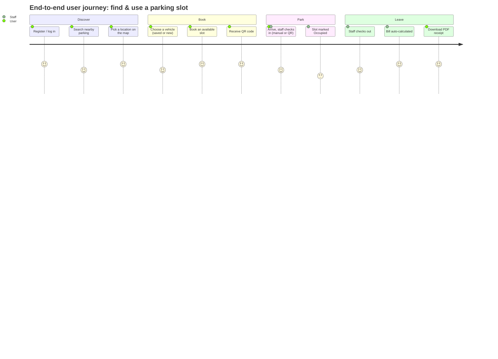

# PRD — Smart Car Parking Management System ("AG Parking")

> Reverse-engineered from the current codebase (`car-parking-app-main`) as of this snapshot. This document describes the product as it is implemented, not a future-facing spec.

## 1. Summary

A full-stack web + Android app for managing parking slots across one or more physical parking locations (e.g. campus blocks, off-campus lots). It supports three roles — **User**, **Staff**, and **Admin** — covering the full lifecycle of a parking session: discover a nearby location → book a slot → check in (manually or via QR) → check out with an auto-calculated bill → view/download a receipt.

- **Live demo:** `https://car-parking-app-xofv.onrender.com`
- **Deployment model:** one Render Web Service; Express serves the built React app and the API from the same origin.

## 2. Goals

- Let end users find and book a real, physical parking slot near them, right now (no advance/scheduled booking).
- Give on-site staff a fast way to check vehicles in/out and settle billing without manual arithmetic.
- Give admins full visibility and control: slots, locations, staff assignment, users, and revenue — system-wide and per-location.
- Provide a self-serve conversational assistant for common questions (availability, locations, bookings, account) without depending on a paid external LLM.
- Support both a browser experience and a native Android app from a single React codebase.

## 3. Non-goals

- Advance/scheduled bookings (explicitly removed — "every booking is for right now").
- Payment processing / online payment capture (billing is calculated and shown; no payment gateway integration exists in the code).
- Multi-country vehicle-plate support (registration-number validation is India-specific: state/RTO/series/number format, plus the 2021 Bharat Series format).
- Real-time GPS turn-by-turn navigation inside the app beyond a Leaflet map + OSRM route/ETA.

## 4. Users & Roles

| Role | Who they are | Core capabilities |
|---|---|---|
| **User** | General public / students / employees | Register (OTP-verified email), manage profile & saved vehicles, find nearby parking, book a slot, view/cancel bookings, view QR code & download PDF receipt, chat with AI assistant, contact support |
| **Staff** | On-site personnel, each tied to exactly one `ParkingLocation` | Manual check-in/check-out, QR-based check-in, view/cancel bookings **scoped to their own location only**, location-scoped dashboard stats, AI assistant scoped to their location |
| **Admin** | System operators | Everything Staff can do, system-wide and per-location; manage parking locations; manage slots & pricing; manage staff assignment per location; manage user roles/status; view revenue (overall & per-location); occupancy insights via AI assistant |

A user's JWT bakes in a `tokenVersion`; if an admin changes a user's role/location, their existing session is invalidated server-side on the next request (forcing re-login) rather than waiting for token expiry.

```mermaid
flowchart TD
    Role[["Role"]]
    Role --> User["User\n(general public)"]
    Role --> Staff["Staff\n(one ParkingLocation)"]
    Role --> Admin["Admin\n(system-wide)"]

    User --> U1["Register / login (OTP)"]
    User --> U2["Manage profile & vehicles"]
    User --> U3["Find nearby parking"]
    User --> U4["Book a slot"]
    User --> U5["View/cancel bookings, QR, receipt"]
    User --> U6["AI assistant + support"]

    Staff --> S1["Manual + QR check-in/out"]
    Staff --> S2["View/cancel bookings\n(own location only)"]
    Staff --> S3["Location-scoped dashboard"]
    Staff --> S4["AI assistant\n(locked to own location)"]

    Admin --> A1["Everything Staff can do,\nsystem-wide"]
    Admin --> A2["Manage locations, slots, pricing"]
    Admin --> A3["Manage staff assignment"]
    Admin --> A4["Manage users & roles"]
    Admin --> A5["Revenue reports\n(overall + per-location)"]
```

## 5. Key Features (as implemented)

### 5.1 Authentication & Account
- Registration is a two-step OTP flow: `POST /auth/register/initiate` → email OTP (Brevo API) → `POST /auth/register/verify` creates the account.
- Login issues a JWT (`JWT_EXPIRE`, default 7d).
- Forgot/reset password flow.
- Profile update, password change, and **email change** (also OTP-verified).
- **Account deletion is a soft delete**: name/email/password/vehicles are anonymized and `isDeleted: true` is set, rather than removing the document — this keeps every historical booking's user reference resolvable. The booking itself separately snapshots the user's name/email at booking time so staff/admin still see the original identity on old records.
- Users can save multiple vehicles (`2 Wheeler` / `3 Wheeler` / `4 Wheeler`, with a validated Indian registration number or a "registration pending" flag for brand-new vehicles) and pick one at booking time instead of retyping details.

### 5.2 Parking Locations & Discovery
- Admin manages `ParkingLocation` records: name, address, description, geo-coordinates (GeoJSON Point), amenities, active flag.
- **Nearby Parking** (user-facing): geo search by radius or by a geocoded point (via free/keyless Nominatim + OSRM services rendered on an in-app Leaflet map — no Google Maps dependency, no redirect to an external app).
- Users pick a location, then see and book only that location's slots (the older "book from a global slot list" flow has been removed/redirected).

### 5.3 Slot Management
- Slots have a number, floor, type (`standard` / `faculty` / `disabled` / `ev`), hourly rate, and status (`Available` / `Booked` / `Occupied` / `Maintenance`).
- Slots can optionally belong to a `ParkingLocation`; legacy slots without one keep working off a free-text `location` string.
- Admin: create/update/delete slots, update pricing, per-location and system-wide slot stats.

### 5.4 Booking Lifecycle
- A booking is always "for now" — no future scheduling.
- Business rule: a user may hold at most **one** booking in `Booked` status (awaiting check-in) at a time; once checked in (`Active`), they can book again (e.g. for a second vehicle).
- A `Booked` booking not checked in within **1 hour** auto-expires (cron job every minute, plus a self-healing check on every relevant read/write so stale data never lingers even if the process was asleep).
- Booking states: `Booked → Active → Completed`, or `Booked → Cancelled` / `Expired`.
- Cancellation is only allowed before check-in.
- Every booking gets a single-use QR token at creation time for the QR check-in flow (separate from, and additive to, the manual check-in flow).
- Users can download a PDF receipt and fetch their booking's QR code image.

### 5.5 Check-In / Check-Out (Staff)
- Manual check-in/check-out by staff (location-scoped — a staff member can only act on bookings belonging to their assigned location; admins are unrestricted).
- QR-based check-in: staff scans/verifies a QR, backend matches the token against the stored one and marks it used (`qrUsed`) so it can't be replayed.
- Checkout calculates the bill via `BillingService`: duration rounded **up** to the next full hour, with a 1-hour minimum, multiplied by the slot's hourly rate.
- Staff can also cancel a booking (subject to the same "not after check-in" rule and location scoping).

### 5.6 Revenue & Reporting (Admin)
- Overall revenue and daily revenue trend (last N days).
- Revenue broken down **per parking location**.
- Slot/occupancy stats.

### 5.7 AI Assistant
- Self-hosted (no external LLM API key) TF-IDF + Logistic Regression intent classifier (Python/Flask), spawned as a child process by the Node backend.
- Two kinds of intents: `knowledge` (canned responses — greeting, thanks, goodbye, etc.) and `tool` (backed by live data — slot availability, locations, occupancy insights, a user's own bookings/vehicles, and for admins, revenue/user-registry lookups).
- Responses and available tools are role-scoped; staff queries are automatically locked to their own location regardless of what the message text says.
- Rate-limited per user (20 requests/minute) on top of the app's general API rate limit.
- Falls back gracefully / can be disabled entirely (`SKIP_AI_PROCESS=true`) — the rest of the app works without it.
- There is also a `POST /api/ai/scan-plate` endpoint that accepts an image, but the classifier is text-only (no vision model) — it deliberately responds with a clear "not available, please type your plate number" message rather than attempting OCR.

### 5.8 Real-time Updates
- Socket.io, sharing the same HTTP server/port as Express (so Render's single-service model still works).
- Events: `slotUpdated`, `bookingCreated`, `bookingCancelled`, `bookingUpdated`/`bookingExpired`.
- Staff/admin broadcasts are location-scoped (`loc:<locationId>` rooms) so staff only see events for their own site; admins see everything.

### 5.9 Support
- Landing-page "Contact Us" form posts to the backend, which relays to EmailJS server-side (private key), so the browser never talks to EmailJS directly. Degrades gracefully (disables itself) if EmailJS env vars are unset.
- In-app Help & Support modals per role.

### 5.10 Mobile (Android)
- Same React codebase packaged via Capacitor into a native Android app (`frontend/android`).
- Requires `VITE_API_BASE_URL` to point at the deployed backend (the app runs from `capacitor://localhost`, which has no backend at that origin) and requires those Capacitor origins to be allow-listed in `CORS_ORIGIN`.

## 6. Non-functional Requirements (as implemented)

- **Security:** Helmet CSP, `xss-clean`, JWT auth, role-based authorization, per-route rate limiting, CORS allow-list (comma-separated origins), password hashing (bcrypt, 12 rounds), session invalidation on permission change.
- **Reliability:** slot booking uses an atomic `findOneAndUpdate` (not read-then-write) to avoid double-booking races; booking creation rolls back the slot on failure; stale-booking expiry self-heals on read in addition to the cron job (protects against free-tier host sleep/wake cycles).
- **Data integrity:** historical bookings retain a name/email snapshot and a `locationId` denormalized from the slot, so reporting and display remain correct even as users are (soft) deleted or slots are edited.
- **Performance:** targeted MongoDB indexes on the hot query paths (booking by user/status, by slot/status, by location/status, by expiry; slot by status/type/location; user by role/location; geospatial 2dsphere index on location coordinates).
- **Cost:** designed to run entirely on free tiers (Render free web service, MongoDB Atlas M0, Brevo free email, self-hosted AI model — no paid LLM API).

## 7. Out of Scope / Known Limitations

- No online payment capture — billing is computed and displayed/receipted only.
- No advance booking / reservation for a future time.
- Vehicle number validation is India-specific.
- Render's free tier spins down after inactivity — first request after idle can take 30–60s, and the cron-based auto-expiry can lag behind until something wakes the process (mitigated by the self-healing checks described above, not eliminated).