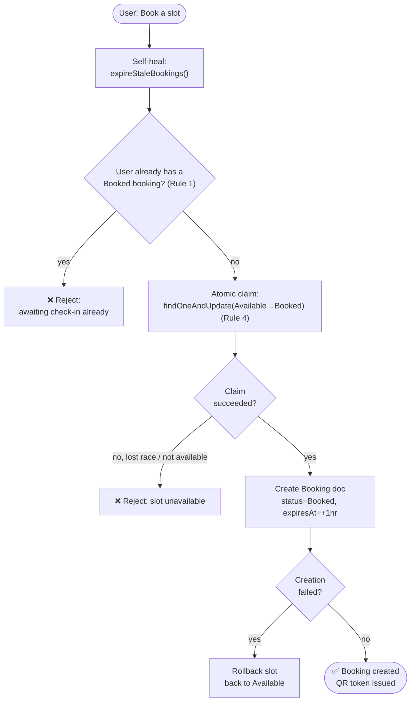
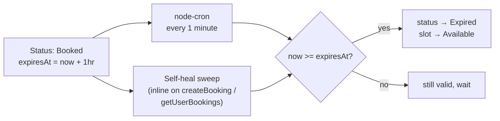
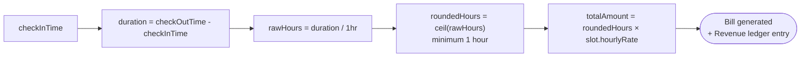
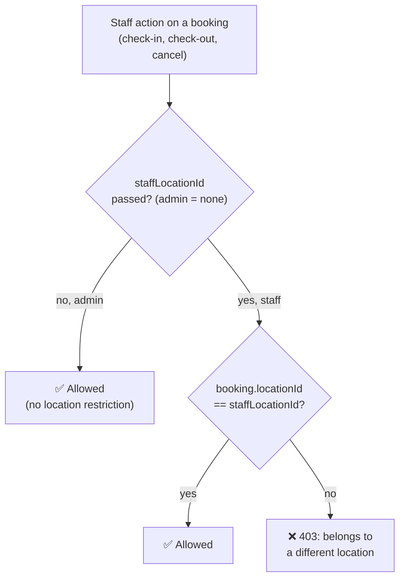
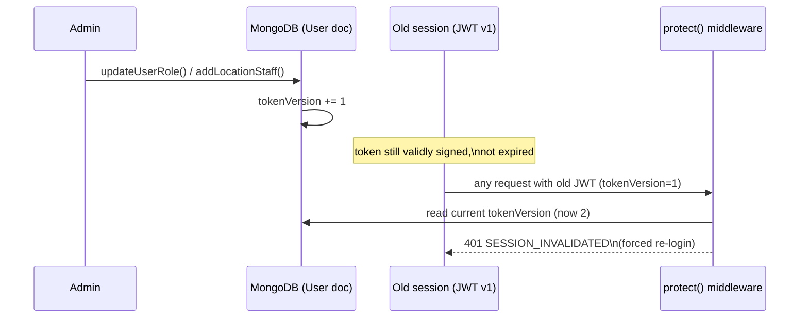
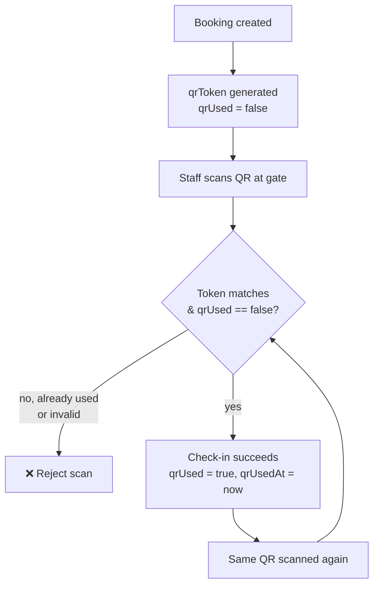

# RULES — Business Rules & Invariants

This is a catalogue of the business rules actually enforced in code (not aspirational rules). Each entry names where it's enforced so a change can be traced back to its source of truth.

## Booking rules

**Rule 1 — One active "awaiting check-in" booking per user.**
A user may hold at most one booking in `Booked` status at a time. Once that booking is checked in (becomes `Active`), the user is free to create another booking (e.g. for a second vehicle). Enforced in `BookingService.createBooking` via `Booking.hasBookedBooking(userId)`, checked *after* a self-heal expiry sweep so a booking that's actually stale (but not yet swept by the cron job) doesn't wrongly block a new one.

**Rule 2 — 1-hour check-in window, then auto-expiry.**
A `Booked` booking must be checked in within 1 hour (`BOOKED_TTL_MS = 60 * 60 * 1000`) or it is automatically marked `Expired`, and its slot is released back to `Available`. Enforced by:
- a `node-cron` job running every minute (`server.js`), and
- an inline self-heal call to the same `expireStaleBookings()` at the top of `createBooking` and `getUserBookings` — this exists because Render's free-tier process can sleep and pause the cron, so the very request that wakes it up must still see correct data immediately, not stale "Booked" state.

**Rule 3 — Users can save multiple vehicles.**
A user's account can hold any number of saved vehicles (`User.vehicles`); a booking may reference one of them (`vehicleId`) or supply a one-off vehicle inline. Enforced in `User` model + `BookingService.createBooking` + `auth.controller`/`auth.routes` vehicle CRUD endpoints.

**Rule 4 — No double-booking of a slot (atomicity).**
A slot can only be booked by one request even under concurrent attempts. Enforced via a single atomic `ParkingSlot.findOneAndUpdate({_id, status:'Available', isActive:true}, {$set:{status:'Booked'}})` — never a read-then-write. If the booking document creation subsequently fails for any reason, the slot is explicitly rolled back to `Available`.

**Rule 5 — Cancellation is only allowed before check-in.**
A booking with status `Active` (or with a `checkInTime` already set) cannot be cancelled — enforced in `BookingService.cancelBooking`. Attempting to cancel an already `Completed`/`Cancelled`/`Expired` booking is also rejected.

**Rule 6 — Booking ownership.**
A regular user may only cancel/view their own bookings unless the action is performed by staff/admin (`cancelledBy` param path). Enforced in `BookingService.cancelBooking` and mirrored in `getBookingQRImage`/receipt access checks.

**Rule 7 — No advance/scheduled booking.**
Every booking is created for "now" — there is no future booking date/time field on `Booking`. This was a deliberate removal from an earlier version of the product (see comments in `BookingService.createBooking`).

## Vehicle validation rules

**Rule 8 — Indian vehicle registration number format.**
A vehicle number must match either:
- the standard format `SS RR CCC NNNN` (2-letter state/UT code from a fixed allow-list of valid Indian RTO codes, 1–2 digit RTO code ≥ 1, 1–3 letter series, 4-digit number), or
- the 2021 "Bharat Series" format `YY BH NNNN XX` (no state-code check applies here).

Numbers are normalized (uppercased, spaces/hyphens stripped) before validation and storage, so `"WB 01 AB 1234"` and `"WB01AB1234"` are equivalent. Enforced in `utils/vehicleValidation.js`, used by both `BookingService` and the saved-vehicle endpoints. The frontend (`lib/vehicleValidation.js`) mirrors this for client-side UX, but the backend is the source of truth.

**Rule 9 — Registration-pending vehicles.**
A brand-new, not-yet-registered vehicle can be booked/saved with `registrationPending: true` and no `vehicleNumber`, bypassing Rule 8. A vehicle number is required whenever `registrationPending` is false.

## Billing rules

**Rule 10 — Round up to the next full hour, 1-hour minimum.**
Billing = `ceil(durationHours)` (minimum 1 hour) × the slot's `hourlyRate` at checkout time. A 61-minute stay is billed as 2 hours; a 10-minute stay is billed as 1 hour. Enforced in `BillingService.calculateBill` (instantiated per hourly rate; not a static/global calculation, so slot-specific rates are always respected). Checkout time cannot be before check-in time (`BillingService.getDurationMs` throws otherwise).

## Access-control / multi-location rules

**Rule 11 — Staff are pinned to exactly one location.**
`User.locationId` is set only for `role: 'staff'`. Every staff-facing service method that touches a booking or slot accepts a `staffLocationId` and rejects operations on data belonging to a different location (`403`). Admins bypass this by not passing a `staffLocationId`. Enforced in `StaffService.checkIn/checkOut`, `BookingService.cancelBooking`, and location-scoped queries in `staff.controller`/`AdminService`.

**Rule 12 — Role/location changes force re-login.**
Whenever an admin changes a user's `role` or a staff member's `locationId` (`AdminService.updateUserRole`, `addLocationStaff`, `removeLocationStaff`), the target user's `tokenVersion` is incremented. `auth.middleware.protect` compares the JWT's baked-in `tokenVersion` against the current DB value on every request and rejects the request (`SESSION_INVALIDATED`, 401) if they differ — even though the token itself is still validly signed and unexpired. This is what actually revokes an already-issued session the moment permissions change.

**Rule 13 — Deactivated / deleted accounts are locked out immediately.**
`protect` rejects requests from a user with `isActive: false` (`ACCOUNT_DEACTIVATED`) or `isDeleted: true` (`ACCOUNT_DELETED`), regardless of token validity.

**Rule 14 — Account deletion is a soft delete, and history is snapshotted, not just linked.**
Deleting an account anonymizes the `User` document (name/email/password/vehicles wiped, `isDeleted: true`) rather than removing it — so `Booking.userId` (and any other reference) stays populate()-able and distinguishable from "this id never existed." Independently, `Booking.userName`/`Booking.userEmail` are snapshotted at booking-creation time, so staff/admin viewing an old booking always see the identity as it was *then*, even after the account is later anonymized.

**Rule 15 — Location-scoped real-time events.**
Booking-lifecycle Socket.io events aimed at staff/admin are sent to `admin` (always) and to `loc:<locationId>` (only staff of that specific location) — never a blanket broadcast to every staff member system-wide, except as a fallback for legacy bookings whose slot has no `locationId`.

## AI assistant rules

**Rule 16 — Staff's AI scope is locked to their own location.**
When the caller is staff, `ctx.locationId` (derived from their account, not from the chat message) always overrides any location name/id parsed out of the user's message text. A staff member cannot ask the assistant about another location's data by naming it in the chat.

**Rule 17 — Role-gated intents/tools.**
Each intent in `ai/config/intents.json` declares which roles may trigger it (`roles: []` means "resolved dynamically by the tool," not "nobody"). Financial (`revenue`) and user-registry tools are admin-only; personal booking/vehicle lookups are user-only; availability/location/occupancy tools are available to all authenticated roles.

**Rule 18 — Confidence threshold.**
The intent classifier only acts on a prediction if its confidence clears `confidence_threshold` (0.35 in `ai/config/intents.json`); otherwise it should fall back to a default/clarifying response rather than guessing an intent.

## QR check-in rules

**Rule 19 — QR tokens are single-use.**
Each booking is issued a random `qrToken` at creation time. On successful QR-based check-in, `qrUsed` is set `true` and `qrUsedAt` is recorded — so a screenshotted/reused QR code cannot check in twice, even though the manual check-in flow never touches these fields (the two flows are independent but converge on the same booking state machine).

## Data/consistency rules

**Rule 20 — `locationId` denormalization.**
`Booking.locationId` is copied from the slot at booking creation, not derived via a join at query time. This exists purely for query performance on hot paths (a staff member's own bookings, per-location revenue) and must be kept in sync by anything that reassigns a slot's location (see `AdminService`), or those two fields can silently diverge for already-existing bookings.